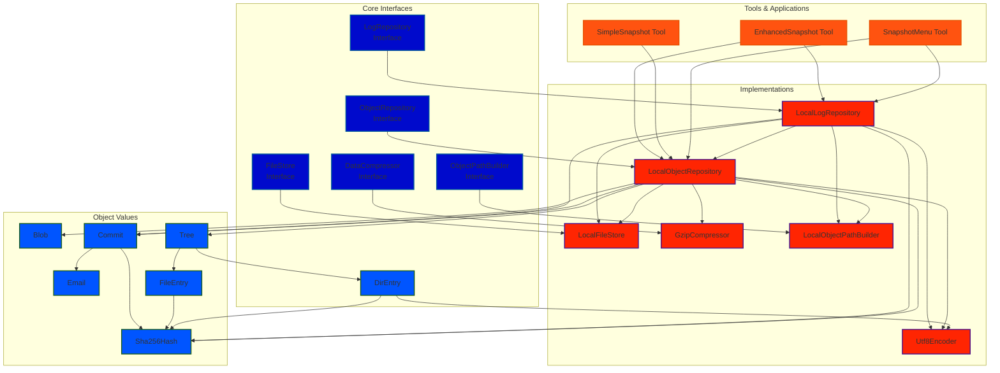
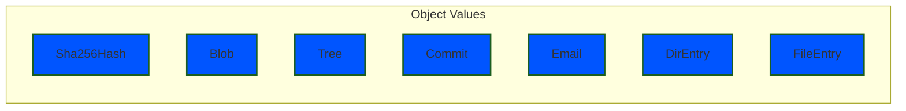
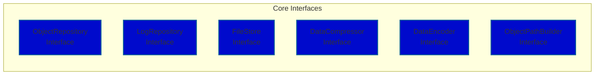

<!-- deno-fmt-ignore -->
Devs en los 90's
================

Durante la década de los 90, el trabajo de los desarrolladores era muy diferente
al que conocemos hoy. La colaboración en proyectos de software era mucho más
complicada, y muchos de los problemas que hoy resolvemos con Git simplemente no
tenían solución estándar.

## Colaboración limitada

- Los equipos trabajaban de forma presencial, compartiendo el código en:

- Disquetes

- Carpetas en servidores locales

- E-mails con archivos adjuntos

- Copias llamadas “final”, “final2”, “finalahoraSi”

Todo esto generaba conflictos constantes y pérdida de versiones.

<!-- deno-fmt-ignore -->
Devs en los 90's
================

## Control de versiones “manual”

Antes de que existieran herramientas modernas, los devs usaban métodos como:

- Copiar y renombrar carpetas (“Proyecto_v1”, “v1_copia”, “v1_BUENO”, etc.)

- Guardar archivos con fecha en el nombre

- Comentarios en el código diciendo “no tocar esta parte”

Era fácil romper algo y no poder volver atrás.

## Nacimiento de los primeros sistemas de control de versiones

A finales de los 80 y durante los 90 aparecieron los primeros intentos serios de
manejar versiones:

- RCS (Revision Control System) — Funcionaba por archivo, no por proyecto.

- CVS (Concurrent Versions System) — Permitía colaboración, pero dependía
  fuertemente de RCS.

- Más tarde, Subversion (SVN) vino a corregir muchas limitaciones.

Estas herramientas introdujeron conceptos que hoy damos por sentado: commits,
historial, repositorio, archivos versionados…

<!-- deno-fmt-ignore -->
Sistemas de Control de Versiones
================================

En el desarrollo de software, uno de los mayores desafíos es mantener un control
organizado sobre los cambios que se realizan a lo largo del tiempo.

Los sistemas de control de versiones (VCS) permiten registrar cada modificación
en un proyecto, restaurar versiones anteriores y trabajar de forma colaborativa
sin perder el historial de los cambios realizados.

<!-- deno-fmt-ignore -->
Git
===

# ¿Qué es Git?

Git es un sistema de control de versiones. En palabras simples, sirve para
guardar y controlar los cambios que se hacen en los archivos de un proyecto,
especialmente cuando varias personas trabajan en el mismo código. Imaginá que
estás programando con tu grupo: Cada vez que uno modifica algo, Git registra
esos cambios como una especie de “foto” del proyecto en ese momento. Si alguien
comete un error o borra algo, podés volver atrás a una versión anterior sin
perder todo el trabajo

# ¿Cómo funciona Git?

Git se basa en tres etapas principales:

- Working Directory (Directorio de trabajo): Es donde vos editás tus archivos
  normalmente.

- Staging Area (Área de preparación): Es como una “zona intermedia” donde elegís
  qué archivos querés guardar en la próxima versión. → Esto se hace con el
  comando git add (sirve para seleccionar los archivos que querés guardar en el
  próximo commit).

- Repository (Repositorio): Es donde se guardan oficialmente todas las versiones
  del proyecto. → Esto se hace con el comando git commit -m "mensaje" (sirve
  para guardar una nueva versión del proyecto con una descripción del cambio).

<!-- end_slide -->

<!-- deno-fmt-ignore -->
Git
===

Cuando ya querés compartir los cambios con tu equipo, usás:

- git push (sirve para subir tus cambios al repositorio remoto, por ejemplo
  GitHub o Magnesium)

- git pull (sirve para descargar o actualizar tu proyecto con los cambios que
  subieron otros compañeros)

¿Por qué nos llevó a crear un Magnesium? Git real es muy complejo: maneja muchos
comandos, versiones, ramas, historial, etc. Entonces, en lugar de usar
directamente Git, el proyecto Magnesium busca simular sus funciones básicas para
aprender su lógica.

Por ejemplo, Magnesium puede imitar comandos como:

- init (sirve para crear o inicializar un nuevo repositorio)

- commit (sirve para registrar los cambios con un mensaje)

<!-- end_slide -->

<!-- deno-fmt-ignore -->
Git
===

# Magnesium

Magnesium busca replicar la lógica central de GIT, permitiendo que podamos
entender cómo un sistema de control de versiones almacena, organiza y recupera
los cambios de un proyecto.

<!-- deno-fmt-ignore -->
Objetivos
=========

# Objetivo general

- Desarrollar e implementar un sistema de control de versiones simplificado,
  denominado Magnesium.

# Objetivos Específicos

- Simular el funcionamiento de un sistema de control de versiones real.
- Aplicar el uso de estructuras de datos abstractas en la resolución de
  problemas.
- Comprender la importancia del versionado.
- Demostrar la aplicación práctica de las estructuras de datos.
- Utilizar técnicas de programación orientada a objetos en el diseño e
  implementación de sistemas.

<!-- deno-fmt-ignore -->
Importancia
===========

El desarrollo de un sistema como Magnesium tiene una gran relevancia en el
ámbito de la Ingeniería en Informática, ya que permite comprender de forma
práctica los fundamentos del control de versiones, una de las herramientas más
esenciales en el ciclo de vida del software. A través de Magnesium, los
estudiantes y profesionales podemos:

- Registro, almacenamiento y administracion de cambios.
- Análisis, diseño e implementación de estructuras de datos.
- Visión técnica y crítica.

<!-- end_slide -->

<!-- jump_to_middle -->
<!-- text_align: center -->
<!-- deno-fmt-ignore -->
Arquitectura
============

<!-- deno-fmt-ignore -->
Arquitectura
============

<!-- deno-fmt-ignore -->
Tipos de Datos
==============

<!-- deno-fmt-ignore -->
Interfaces
==========

<!-- deno-fmt-ignore -->
Demostración
============

En esta sección, se muestra cómo Magnesium simula un sistema real de control de
versiones:

1. Simulación de Commit: Magnesium registra cambios en archivos y los asocia a
   commits, cada uno con un hash único para identificarlo.

2. Estructuras de Datos: Utiliza estructuras como árboles de directorios y
   listas de commits para organizar el historial de cambios.

3. Rendimiento y Uso: Con comandos básicos, los usuarios pueden realizar
   cambios, hacer commits y ver el historial de versiones.

4. Integridad y Colaboración: Mantiene la integridad de los datos sin depender
   de bases de datos externas y facilita la colaboración sin perder el
   historial.

<!-- deno-fmt-ignore -->
Conclusión
==========

Magnesium ofrece una comprensión clara del funcionamiento de los sistemas de
control de versiones, simula cómo gestionan archivos, calculan hashes y
mantienen un historial de cambios. El proyecto logra sus objetivos educativos y
técnicos, demostrando cómo estos sistemas son esenciales para la colaboración,
la integridad de los datos y la productividad en proyectos de desarrollo de
software.
